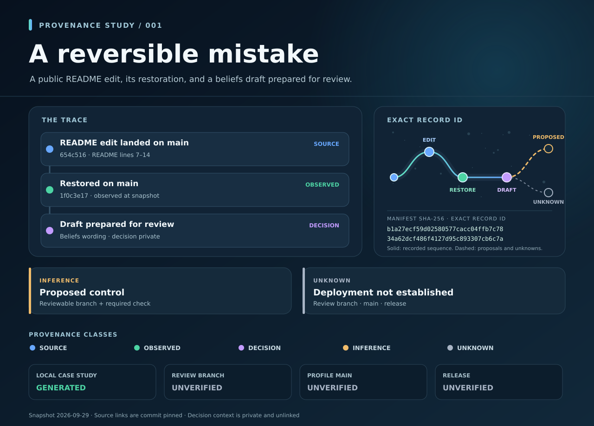

# A reversible mistake · provenance case study



[Phone SVG](card-mobile.svg) · [full 360 × 1630 PNG preview](card-360.png) · [desktop PNG preview](card-1280.png)

This is a dated account of one public README edit and its reversal. The card is a visual index into [manifest.json](manifest.json). It is prepared for a review branch alongside a proposed developer-beliefs draft. It does not claim that the draft, a skill, a branch gate, or a release has reached `main`.

## Follow the record

| Class | What the card says | Evidence and limit |
| --- | --- | --- |
| **SOURCE** · blue | The profile README edit landed in `main` history. | [Exact added lines at commit `654c516`](https://github.com/cortezbuilds/cortezbuilds/blob/654c51648f43bfa861c1f9bdc1fa3dbee2ec4c4d/README.md?plain=1#L7-L14). Git history does not establish which API or branch operation made the write. |
| **OBSERVED** · green | The next commit restored the prior README tree. | [Revert commit `1f0c3e17`](https://github.com/cortezbuilds/cortezbuilds/commit/1f0c3e17d3e99a47241ebc00abdbe4e8071c7a5b); [restored lines at that commit](https://github.com/cortezbuilds/cortezbuilds/blob/1f0c3e17d3e99a47241ebc00abdbe4e8071c7a5b/README.md?plain=1#L5-L9). A readback at 2026-09-29 08:45 UTC found the revert at `main`; that branch pointer may have changed since. |
| **DECISION** · violet | A beliefs draft was prepared for review. | The instruction is paraphrased from a private conversation. It has no public permalink. This class is an attributed decision, not an independently verified execution event. |
| **INFERENCE** · amber | A reviewable branch and required check are proposed controls. | [GitHub branch protection documentation](https://docs.github.com/en/repositories/configuring-branches-and-merges-in-your-repository/managing-protected-branches/about-protected-branches) describes the mechanism. The card makes no claim that a required check is configured. |
| **UNKNOWN** · gray | Review branch, `main`, and release states were unverified at the snapshot. | Later publication needs a new event record. The snapshot is deliberately not rewritten to make its earlier state look prescient. |

The five classes are written on the graphic as well as colored. The solid path depicts the recorded edit, restoration, and draft decision; dashed paths are possible future controls and unknown outcomes. These are **decision paths**, not Git refs.

## Check the files

Run from this directory in a clean clone with Python 3.10 or later:

```bash
python3 provenance_card.py verify
python3 mobile_card.py verify
python3 -m unittest discover -s tests -v
```

To rebuild after an intentional manifest edit:

```bash
python3 provenance_card.py build
python3 mobile_card.py build
```

The builders use only Python's standard library and have no network calls or paths outside this directory. They deterministically render both SVGs from the manifest. `receipt.json` holds the domain-separated canonical manifest SHA-256 and desktop SVG SHA-256. `mobile-receipt.json` holds the same manifest ID, the desktop SVG hash, and the phone SVG hash. The full manifest ID appears on both cards. The 360 px SVG has a 1630 px high layout; it scrolls on a phone rather than cropping or shrinking 1280 px content.

The PNGs are convenience previews rendered from their SVGs. The standard library verifier does not reproduce or authenticate the PNG renderer. The SVGs and JSON are the checked source of the visual record.

The [captured build record](validation/README.md) separately records a clean replay of both SVG builds, both verifiers, tests, and PNG rendering. Its metadata-only receipts match the files in this directory; they are bounded subprocess observations, not a complete agent transcript.

These are **unsigned consistency checks**. A person who can edit all files can recompute both receipts. The checks do not attest to authorship, a trusted timestamp, skill activation, complete event capture, or the current state of GitHub. Exact bytes of an image or voice input were not supplied to this case study; its SVG is an output. Similarity fingerprints could help search for related media but would not prove the execution that created it.
